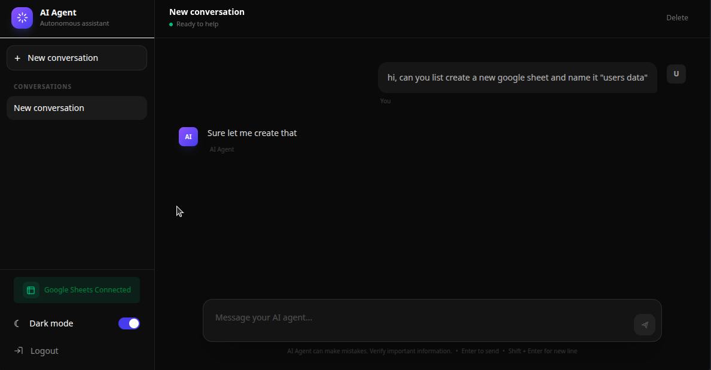

# AI Agent

A full-stack AI agent app with a chat interface backed by an LLM (via OpenRouter) and tool integrations through Composio (e.g. Google Sheets).



## Stack

- **Frontend**: React 19 + TypeScript, Vite, Tailwind CSS, React Router
- **Backend**: Node.js + Express, TypeScript, Drizzle ORM + PostgreSQL, LangChain/LangGraph, Composio, JWT auth

## Project structure

```
frontend/   React SPA (auth pages, chat home, protected routes)
backend/    Express API (auth, conversations, chat, agent/Composio integration)
```

## Getting started

### Backend

```bash
cd backend
cp .env.example .env   # fill in your values
npm install
npm run dev
```

### Frontend

```bash
cd frontend
cp .env.example .env   # fill in your values
npm install
npm run dev
```

The backend requires a PostgreSQL database (see `DATABASE_URL` in `backend/.env.example`) and API keys for OpenRouter and Composio.
